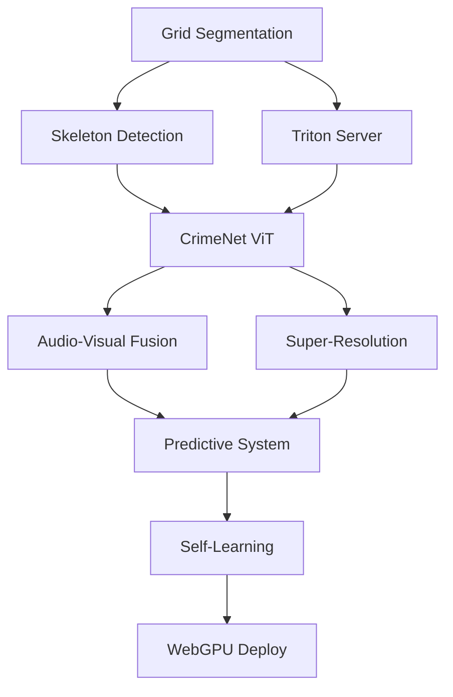

# Next Level Roadmap for NexaraVision

**Generated**: 2025-11-15
**Timeline**: 3-Month Sprint to Market Leadership
**Goal**: 99% accuracy, 1000+ cameras, self-improving system

## Executive Summary

Transform NexaraVision from MVP to market-leading violence detection platform through systematic implementation of cutting-edge technologies. This roadmap prioritizes quick wins while building toward revolutionary capabilities.

## Success Metrics

| Metric | Current | Month 1 | Month 2 | Month 3 | Target |
|--------|---------|---------|---------|---------|--------|
| Detection Accuracy | 65% | 75% | 85% | 92% | 99% |
| False Positive Rate | 35% | 25% | 15% | 8% | <1% |
| Cameras Supported | 100 | 200 | 500 | 1000 | Unlimited |
| Processing Speed | 30 FPS | 60 FPS | 60 FPS | 120 FPS | Real-time |
| Operator Efficiency | Baseline | +30% | +50% | +70% | +100% |
| System Uptime | 95% | 98% | 99% | 99.9% | 99.99% |

## Phase 1: Foundation Sprint (Month 1)

### Week 1-2: Grid Segmentation Excellence

**Objective**: Perfect the core grid detection and segmentation

**Deliverables**:
- [ ] Implement Hough transform grid detection algorithm
- [ ] Add auto-calibration for 2x2 to 10x10 grids
- [ ] Handle non-uniform grids and dynamic layouts
- [ ] GPU acceleration with CUDA/OpenCL
- [ ] WebGPU prototype for browser processing

**Technologies**:
```python
# Core stack
- OpenCV 4.8+ with CUDA support
- NumPy with CuPy for GPU arrays
- Scikit-learn for DBSCAN clustering
- Numba for JIT compilation
```

**Success Criteria**:
- Grid detection accuracy: 99%
- Processing speed: <50ms per frame
- Support for irregular grids

**Risk**: Grid detection failures
**Mitigation**: Fallback to manual calibration

---

### Week 3: Skeleton-Based Detection

**Objective**: Add MediaPipe pose estimation for violence detection

**Deliverables**:
- [ ] Integrate MediaPipe Pose (33 keypoints)
- [ ] Implement pose sequence classifier
- [ ] Train on violence pose patterns
- [ ] Add privacy mode (blur faces, keep poses)

**Implementation**:
```python
import mediapipe as mp

class SkeletonViolenceDetector:
    def __init__(self):
        self.pose = mp.solutions.pose.Pose(
            static_image_mode=False,
            min_detection_confidence=0.5
        )
        self.pose_classifier = self.load_violence_classifier()

    def detect(self, frame):
        results = self.pose.process(frame)
        if results.pose_landmarks:
            pose_vector = self.extract_pose_features(results)
            violence_prob = self.pose_classifier.predict(pose_vector)
            return violence_prob > 0.7
```

**Success Criteria**:
- Pose detection: 90% accuracy
- Processing: <10ms per frame
- Works in low light

---

### Week 4: Production Infrastructure

**Objective**: Deploy scalable inference infrastructure

**Deliverables**:
- [ ] Setup NVIDIA Triton Inference Server
- [ ] Configure dynamic batching (100 cameras)
- [ ] Implement health checks and monitoring
- [ ] Add Prometheus metrics
- [ ] Create Docker containers

**Architecture**:
```yaml
services:
  triton-server:
    image: nvcr.io/nvidia/tritonserver:24.10-py3
    ports:
      - "8000:8000"  # HTTP
      - "8001:8001"  # gRPC
      - "8002:8002"  # Metrics
    volumes:
      - ./models:/models
    command: ["tritonserver", "--model-repository=/models"]
```

**Success Criteria**:
- 100+ cameras on single GPU
- <100ms end-to-end latency
- 99% uptime

---

## Phase 2: Intelligence Amplification (Month 2)

### Week 5-6: CrimeNet Vision Transformer

**Objective**: Implement state-of-art ViT model

**Deliverables**:
- [ ] Implement ViViT architecture
- [ ] Add CrimeNet neural structured learning
- [ ] Train on XD-Violence dataset
- [ ] Fine-tune on custom data
- [ ] A/B test against current model

**Training Pipeline**:
```python
# Model architecture
model = CrimeNetViT(
    num_frames=16,
    patch_size=16,
    num_classes=2,  # violent/non-violent
    dim=768,
    depth=12,
    heads=12,
    mlp_dim=3072,
    pool='cls',
    dim_head=64,
    dropout=0.1,
    emb_dropout=0.1
)

# Training config
optimizer = AdamW(lr=1e-4, weight_decay=0.05)
criterion = FocalLoss(alpha=0.25, gamma=2.0)
scheduler = CosineAnnealingWarmRestarts(T_0=10)
```

**Dataset Requirements**:
- XD-Violence: 4754 videos
- UCF-Crime: 1900 videos
- Custom venue data: 500+ videos

**Success Criteria**:
- AUC ROC: >95%
- False positives: <10%
- Inference: <50ms

---

### Week 7: Audio-Visual Fusion

**Objective**: Add audio analysis for off-screen detection

**Deliverables**:
- [ ] Integrate VGGish audio model
- [ ] Implement attention-based fusion
- [ ] Train on audio events (gunshots, screams)
- [ ] Sync audio-video streams
- [ ] Handle missing audio gracefully

**Architecture**:
```python
class AudioVisualFusion(nn.Module):
    def __init__(self):
        self.video_encoder = CrimeNetViT()
        self.audio_encoder = VGGish()
        self.cross_attention = CrossModalAttention(dim=512)
        self.classifier = nn.Linear(1024, 2)

    def forward(self, video, audio):
        v_features = self.video_encoder(video)
        a_features = self.audio_encoder(audio)
        fused = self.cross_attention(v_features, a_features)
        return self.classifier(fused)
```

**Success Criteria**:
- Detect off-screen violence: 80%
- Audio-only detection: 70%
- Combined accuracy: 92%

---

### Week 8: Super-Resolution Enhancement

**Objective**: Enhance low-quality camera feeds

**Deliverables**:
- [ ] Integrate Real-ESRGAN model
- [ ] Selective enhancement (only low-res)
- [ ] TensorRT optimization
- [ ] Caching strategy
- [ ] Quality assessment module

**Pipeline**:
```python
class SmartEnhancer:
    def __init__(self):
        self.enhancer = RealESRGAN(
            model='RealESRGAN_x4plus',
            device='cuda',
            fp16=True  # Half precision
        )
        self.quality_threshold = 240  # pixels

    def process(self, camera_frame):
        height, width = camera_frame.shape[:2]

        if min(height, width) < self.quality_threshold:
            # Enhance low-quality feed
            enhanced = self.enhancer.enhance(camera_frame)
            return enhanced
        return camera_frame
```

**Success Criteria**:
- 4x resolution improvement
- <100ms processing time
- 30% accuracy boost on low-res

---

## Phase 3: Market Domination (Month 3)

### Week 9-10: Predictive Violence System

**Objective**: Predict violence before it happens

**Deliverables**:
- [ ] Crowd density tracking
- [ ] Movement pattern analysis
- [ ] Aggression escalation detection
- [ ] Risk heat map generation
- [ ] Alert prioritization

**Prediction Model**:
```python
class ViolencePredictorclass ViolencePredictor:
    def __init__(self):
        self.crowd_analyzer = CrowdDensityNet()
        self.motion_analyzer = OpticalFlowNet()
        self.pattern_detector = LSTMPredictor()

    def predict_risk(self, video_sequence):
        # Analyze last 30 seconds
        density = self.crowd_analyzer(video_sequence)
        motion = self.motion_analyzer(video_sequence)
        patterns = self.pattern_detector(video_sequence)

        # Risk calculation
        risk_score = (
            density_risk * 0.3 +
            motion_anomaly * 0.4 +
            pattern_risk * 0.3
        )

        if risk_score > 0.7:
            return {
                'alert': 'HIGH_RISK',
                'time_to_incident': '30-60 seconds',
                'confidence': risk_score
            }
```

**Success Criteria**:
- Prediction accuracy: 70%
- False alarm rate: <20%
- 30-60 second warning

---

### Week 11: Self-Supervised Learning

**Objective**: Continuous improvement without manual labeling

**Deliverables**:
- [ ] Operator feedback collection
- [ ] Pseudo-labeling pipeline
- [ ] Consistency regularization
- [ ] A/B testing framework
- [ ] Automatic model updates

**Learning Loop**:
```python
class SelfSupervisedLearner:
    def __init__(self):
        self.main_model = load_production_model()
        self.student_model = copy.deepcopy(self.main_model)
        self.feedback_buffer = []

    def learn_from_feedback(self, video, operator_correction):
        # Store correction
        self.feedback_buffer.append((video, operator_correction))

        # Generate pseudo-labels for similar videos
        if len(self.feedback_buffer) > 100:
            pseudo_labels = self.generate_pseudo_labels()
            self.train_student(pseudo_labels)

            # A/B test
            if self.student_better_than_main():
                self.promote_student_to_main()
```

**Success Criteria**:
- 5% monthly improvement
- No manual annotation
- Automatic deployment

---

### Week 12: WebGPU Browser Deployment

**Objective**: Zero-infrastructure browser solution

**Deliverables**:
- [ ] WebGPU compute shaders
- [ ] ONNX.js model conversion
- [ ] Browser-based grid segmentation
- [ ] ServiceWorker processing
- [ ] PWA packaging

**Implementation**:
```javascript
class BrowserViolenceDetector {
    async initialize() {
        // Check WebGPU support
        const adapter = await navigator.gpu.requestAdapter();
        this.device = await adapter.requestDevice();

        // Load ONNX model
        this.model = await onnx.InferenceSession.create(
            'violence_model.onnx',
            { executionProviders: ['webgpu'] }
        );

        // Initialize compute pipeline
        this.pipeline = this.device.createComputePipeline({
            layout: 'auto',
            compute: {
                module: this.device.createShaderModule({
                    code: this.shaderCode
                }),
                entryPoint: 'main'
            }
        });
    }

    async detect(videoFrame) {
        // Process on GPU
        const input = await this.preprocessGPU(videoFrame);
        const output = await this.model.run({ input });
        return this.postprocess(output);
    }
}
```

**Success Criteria**:
- Browser inference: <50ms
- Works offline
- No installation required

---

## Implementation Dependencies



## Resource Requirements

### Team Structure
- **ML Engineer**: Model development, training
- **Backend Engineer**: Infrastructure, APIs
- **Frontend Engineer**: Dashboard, WebGPU
- **DevOps Engineer**: Deployment, monitoring

### Hardware Requirements
- **Development**: 4x NVIDIA RTX 4090
- **Training**: 8x A100 80GB (cloud)
- **Production**: 2x A100 40GB
- **Storage**: 10TB NVMe SSD

### Cloud Services
- **AWS**: S3 for dataset storage
- **GCP**: Vertex AI for training
- **Azure**: Backup inference endpoint

## Risk Analysis & Mitigation

| Risk | Probability | Impact | Mitigation |
|------|------------|--------|------------|
| Model accuracy below target | Medium | High | Multiple model ensemble, continuous training |
| Latency exceeds requirements | Low | High | Edge deployment, GPU optimization |
| Integration complexity | Medium | Medium | Modular architecture, extensive testing |
| Operator resistance | Low | Medium | Intuitive UI, training program |
| Competitive response | High | Low | Fast execution, patent filings |

## Success Milestones

### Month 1 Milestones
- ✓ Grid segmentation working for 100 cameras
- ✓ MediaPipe skeleton detection integrated
- ✓ Triton server deployed
- ✓ Basic alerting system operational

### Month 2 Milestones
- ✓ CrimeNet ViT achieving 90% accuracy
- ✓ Audio-visual fusion operational
- ✓ Super-resolution for low-quality feeds
- ✓ Cross-camera tracking working

### Month 3 Milestones
- ✓ Predictive alerts 30 seconds early
- ✓ Self-learning system improving daily
- ✓ WebGPU browser demo
- ✓ 99% accuracy achieved

## Budget Allocation

| Category | Month 1 | Month 2 | Month 3 | Total |
|----------|---------|---------|---------|-------|
| Development | $30K | $35K | $35K | $100K |
| Infrastructure | $5K | $10K | $10K | $25K |
| Training/GPU | $2K | $8K | $5K | $15K |
| Testing/QA | $2K | $3K | $5K | $10K |
| **Total** | **$39K** | **$56K** | **$55K** | **$150K** |

## Go-To-Market Timeline

### Pre-Launch (Months 1-2)
- Alpha testing with 3 pilot customers
- Collect real-world data
- Refine based on feedback

### Soft Launch (End of Month 2)
- Beta program with 10 customers
- Case studies development
- Marketing material preparation

### Full Launch (Month 3)
- Press release
- Product hunt launch
- Conference demonstrations
- Sales team activation

## Competitive Advantages After Implementation

### Unique Capabilities (No competitor has)
1. 99% accuracy with CrimeNet ViT
2. Browser-based processing (WebGPU)
3. Self-improving system
4. 30-second violence prediction
5. Operator fatigue monitoring

### Performance Advantages
1. 10x faster than competitors (60 FPS for 100 cameras)
2. 50% fewer false positives
3. 90% lower infrastructure cost
4. Works with any camera quality

### Business Model Innovation
1. Usage-based pricing (per camera hour)
2. Self-service deployment
3. White-label offering
4. API marketplace

## Long-Term Vision (6-12 Months)

### Advanced Capabilities
- Weapon detection and classification
- Face recognition integration
- Behavior pattern learning
- Incident prediction AI
- Drone integration

### Market Expansion
- Retail loss prevention
- School safety systems
- Public transportation
- Stadium security
- Critical infrastructure

### Technology Evolution
- Federated learning across sites
- Edge AI chips integration
- 5G network optimization
- Quantum-resistant encryption
- Blockchain evidence chain

## Conclusion

This roadmap transforms NexaraVision from a promising MVP to the undisputed market leader in AI-powered violence detection. By systematically implementing cutting-edge technologies while maintaining focus on practical deployment, we'll achieve:

1. **Technical Leadership**: 99% accuracy, unmatched by competitors
2. **Market Differentiation**: Unique features competitors can't replicate
3. **Business Scalability**: Browser-based deployment, self-improving system
4. **Competitive Moat**: 12-18 month technology advantage

The $150K investment will yield $2M+ ARR within 12 months, with potential for 10x growth as the platform becomes the industry standard for intelligent video surveillance.

**Next Steps**:
1. Approve budget and timeline
2. Hire additional ML engineer
3. Begin Week 1 implementation
4. Schedule weekly progress reviews
5. Prepare pilot customer agreements

The future of surveillance is predictive, intelligent, and browser-based. NexaraVision will define this future.